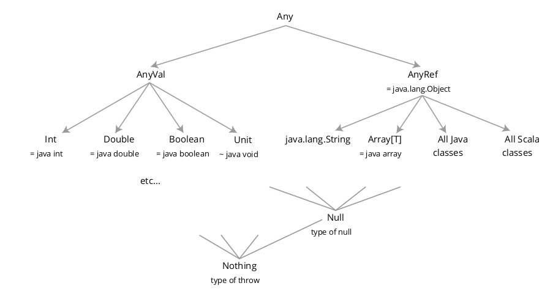

Objects and classes

1/ Scala classes are all subclasses of java.lang.Object and are, for
the most part, usable from Java as well as Scala.

2/```scala
class Name(**val** parameter: type, ...)
```

3/ Notion of Keyword parameters

4/ 


5/ In Scala, by convention, an object can be “called” like a func on if it has a method called apply

6/ Companion objects provide a way of implementing static methods. The common use is auxiliary constructors. 
We can also use this(parameters) to override the constructors. It is important to note 
that the companion object is not an instance of the class — it is a singleton object 
with its own type.
A companion object has the same name as its associated class. This doesn't cause
a naming conflict because Scala has two namespaces: the namespace of values, and the namespace of types.

7/ Features of a case-class :
- a field for each constructor argument (without specifying val or var)
- a default toString
- sensible equals / hashCode methods
- a copy method that creates a new object with the same fields. It is possible to partially override some fields.
- case classes implement java.io.Serializable and scala.Product
- the case class companion object contains an apply method with the same arguments as the class constructor, better for brevity.
- the companion object also contains code to implement an extractor pattern for use in pattern matching.

8/ Scala’s *==* operator is different from Java’s—it delegates to *equals* rather than comparing values on reference identity.
   Scala has an operator called *eq* with the same behaviour as Java’s *==*

9/ Notion of case-object - case class with no constructor arguments.

10/ A pattern can be one of
    - a name, binding any value to that name;
    - an underscore, matching any value and ignoring it;
    - a literal, matching the value the literal denotes; or
    - a constructor-style pattern for a case class.
